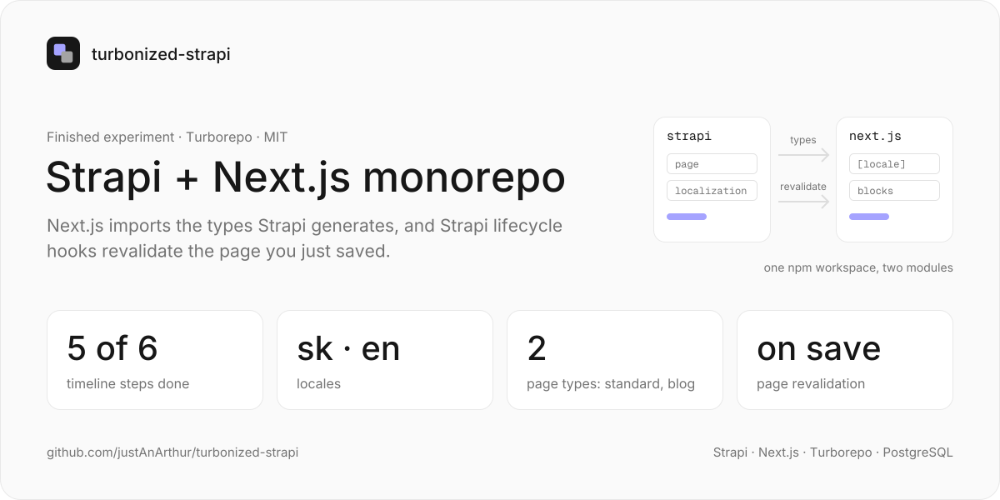
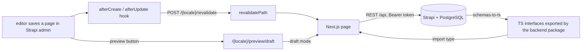

<a href="https://github.com/justAnArthur/turbonized-strapi"></a>

# turbonized-strapi

Strapi 4 and Next.js 14 in one Turborepo monorepo. the frontend imports the TypeScript types Strapi generates from its content types, pages are assembled from Strapi dynamic zones, and a Strapi lifecycle hook revalidates the Next.js page you just saved.

> Finished experiment, archived. five of the six timeline steps below are done; the shared tsconfig/biome package never landed.

## How it works

a `page` in Strapi has a `type` (one of `page-standart`, `page-blog`, each with a slug), a `blocks` dynamic zone and `seo`. the frontend's catch-all route fetches it over the REST API and renders each block with the component of the same name from `components/blocks/`. UI strings come from the `localization` single type, so `sk` and `en` are both edited in Strapi.



- **types**: `@justanarthur/strapi-plugin-schemas-to-ts` writes an interface next to every content type and component in development; `modules/backend/index.ts` re-exports them, and the frontend imports them from `@turbonized-strapi/backend`
- **revalidation**: `src/api/page/content-types/page/lifecycles.ts` posts the page's model, slug and type to `FRONTEND_URL/<locale>/revalidate`, which calls `revalidatePath` for that page
- **preview**: `strapi-plugin-preview-button` links to `/<locale>/preview/draft` or `/published`, which toggles Next.js draft mode; draft mode fetches with `publicationState=preview`
- **i18n**: `next-intl` with `sk` (default, no prefix) and `en`; blog pages live under `/blogs` in English and `/blogy` in Slovak

## Run

### Environment

```shell
> node -v
v20.15.1
```

```shell
> npm -v
10.7.0
```

```json
{
  "packageManager": "^npm@10.7.0",
  "engines": {
    "node": ">=20.0.0"
  }
}
```

### Database

```shell
> psql
> create database "<name>"; // change in .env
```

`modules/backend/turbonized-strapi.sql` (and `.sql.gz`) is a dump of the local database, PostgreSQL 16; load it with `psql -d <name> -f modules/backend/turbonized-strapi.sql` to start with content.

### Start

```bash
npm install
cp modules/backend/.env.example modules/backend/.env
npx turbo dev            # strapi develop + next dev --turbo
```

- `modules/backend/.env`: `APP_KEYS`, `API_TOKEN_SALT`, `ADMIN_JWT_SECRET`, `TRANSFER_TOKEN_SALT`, `JWT_SECRET`; `DATABASE_NAME` / `DATABASE_USERNAME` / `DATABASE_PASSWORD` default to `strapi`; `FRONTEND_URL` turns on revalidation
- `modules/frontend/.env`: `BACKEND_URL` (the Strapi URL) and `BACKEND_API_SECRET` (a Strapi API token)

## Structure

```
modules/backend     @turbonized-strapi/backend: Strapi 4 on PostgreSQL; page + localization content types, blocks, SEO; exports the generated types
modules/frontend    @turbonized-strapi/frontend: Next.js 14 App Router, next-intl, Tailwind; renders Strapi pages and blocks
turbo.json          build, dev and check-types tasks
```

## _Timeline_

1. ✔️ Monorepo with Strapi and Next.js
2. ✔️ Generate Strapi types and Import/Use in Next.js
3. Use shared package for tsconfig and biome, set up linting and formating with .editorconfig
4. ✔️ Setup localization
5. ✔️ Set up dynamic blocks for web
6. ✔️ Set up caching, revalidating strategy with Strapi hooks

## License

MIT
